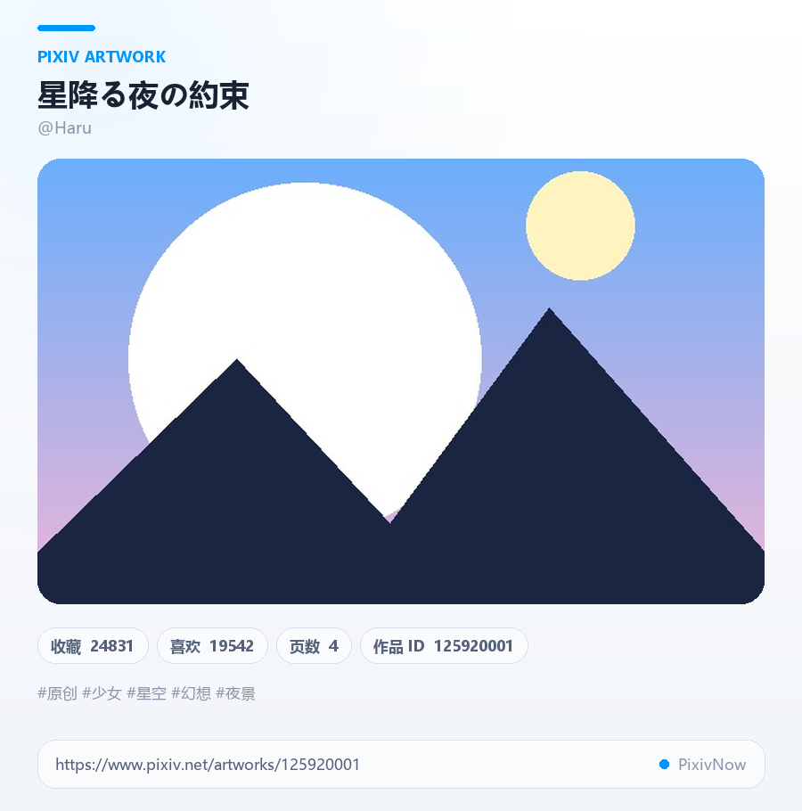
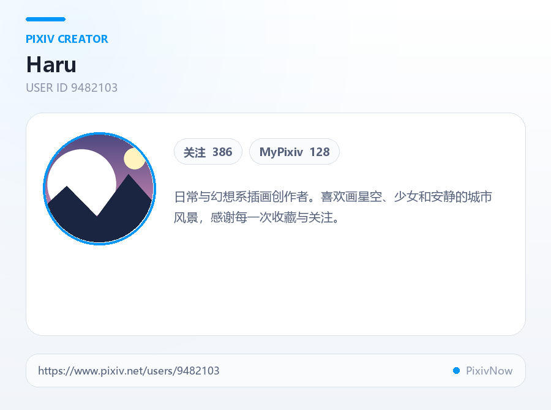
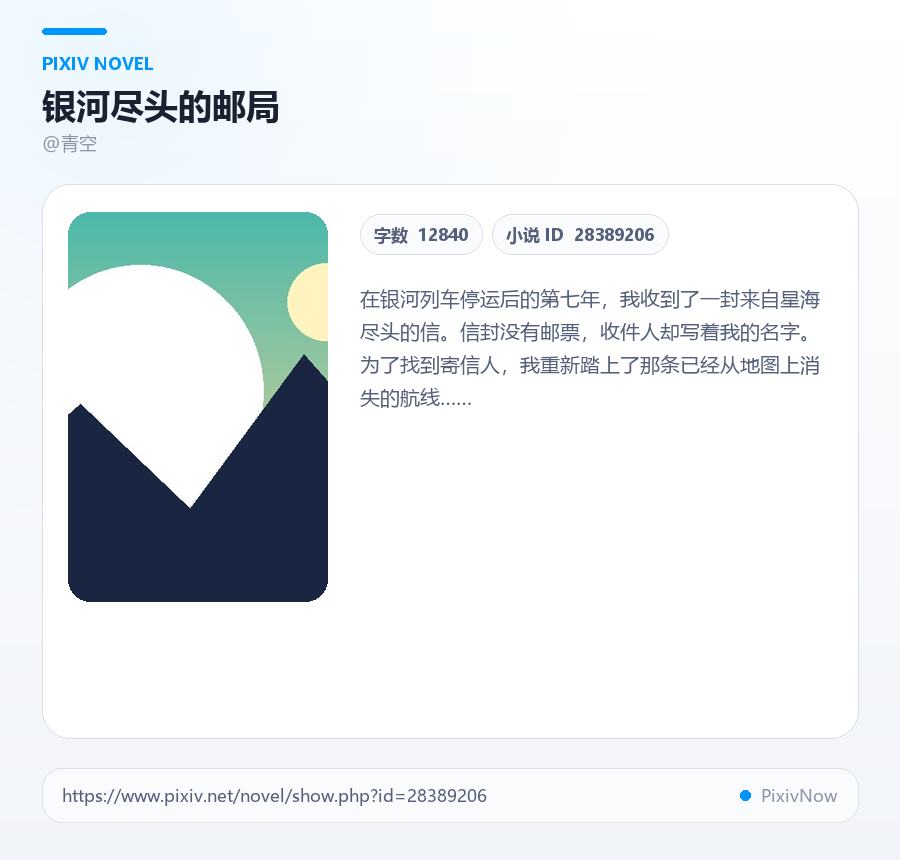

# astrbot_plugin_pixivnow

> 通过自托管的 [PixivNow](https://github.com/features-pixiv/pixiv-now) 服务访问 Pixiv，为 AstrBot 提供随机插画、排行榜、关键词搜索、画作/画师/小说详情等功能。图片统一经 PixivNow 代理下载，绕开 Pixiv 官方的 403 与反爬限制。

版本：`2.2.0`  ·  兼容 AstrBot：`>=4.9.2`  ·  依赖：`httpx>=0.24`、`Pillow>=9.0`

---

## 功能特性

- **随机插画** —— 不带关键词的随机抽取，支持批量（1–10 张）
- **关键词随机** —— 在关键词搜索结果中按需取多页凑齐候选池再随机
- **关键词搜索** —— 进入交互式选图会话，支持翻页 / 跳页 / 选图下载原图
- **排行榜** —— 渲染为单张主题海报（Top 5），含日 / 周 / 月 / 新人 / 男性 / 女性等模式
- **画作详情** —— 主题信息卡 + 多页原图（OneBot 平台走合并转发）
- **画师详情** —— 主题信息卡，含头像、简介、关注数等
- **小说详情** —— 主题信息卡，含封面、作者、字数、正文摘要
- **可配置回复字段** —— 在 AstrBot 管理面板勾选作品回复时附带的信息（标题 / 画师 / 收藏 / 标签 …）
- **暗 / 亮双主题卡片** —— 视觉风格参考 `astrbot_plugin_rika_share`，渐变背景 + 毛玻璃 + 圆角媒体
- **多级缓存** —— API 响应、内存图片、临时文件、渲染结果四级缓存，可分别配置 TTL
- **网络策略可调** —— 超时、并发上限、HTTP KeepAlive、最大内存图片等高级项
- **管理员指令** —— 运行时修改 PixivNow 地址与登录 Token

---

## 快速开始

### 1. 准备 PixivNow 服务

本插件**不直接访问** Pixiv，而是把请求转发到你部署的 PixivNow 实例。两种使用方式：

- **公共实例**：[https://pixiv.js.org](https://pixiv.js.org)（默认地址）
- **自建实例**：参考 [PixivNow 部署文档](https://github.com/features-pixiv/pixiv-now) 自行部署，可获得更稳定的服务与登录态

> 需要排行榜或 R18 内容时，必须在自建实例登录并配置 `token`（Pixiv Cookie `PHPSESSID`）。

### 2. 安装插件

将整个 `astrbot_plugin_pixivnow` 目录放入 AstrBot 的 `data/plugins/` 下，重启 AstrBot 即可在管理面板看到该插件。

### 3. 基础配置

打开 AstrBot 管理面板 → 插件配置，至少填写：

| 字段 | 说明 |
| --- | --- |
| `pixivnow_url` | PixivNow 服务地址（默认 `https://pixiv.js.org`） |
| `token` | （可选）Pixiv 登录 Cookie `PHPSESSID`，需要排行榜 / R18 时必填 |
| `access_key` | （可选）私有部署的访问密钥，作为 `X-Access-Key` 请求头发送 |
| `r18_enabled` | 是否允许 R18 模式（默认 `false`） |
| `default_mode` | 默认内容模式：`safe` / `all` / `r18` |
| `render_theme` | 信息卡主题：`dark` / `light` |
| `caption_fields` | 作品回复中勾选展示的字段（标题、画师、收藏数、标签等） |

也可以在聊天中通过管理员指令运行时修改：

```
/pixiv seturl https://your-pixivnow.example.com
/pixiv settoken <PHPSESSID>
```

---

## 指令一览

所有指令以 `/pixiv`（别名 `/pix`）开头。

### 发现作品

| 指令 | 作用 |
| --- | --- |
| `/pixiv r [数量] [模式]` | 随机插画，1–10 张 |
| `/pixiv rk <关键词> [数量] [模式]` | 关键词随机，先搜索后随机抽取 |
| `/pixiv s <关键词> [页码] [模式]` | 关键词搜索并进入选图会话 |
| `/pixiv top [模式] [类型] [页码]` | 排行榜（海报） |

`mode` 取值：`safe` / `all` / `r18`（R18 需先在配置中启用）。

### 查看详情

| 指令 | 作用 |
| --- | --- |
| `/pixiv i <作品ID>` | 画作详情卡 + 多页原图 |
| `/pixiv u <画师ID>` | 画师资料卡 |
| `/pixiv n <小说ID>` | 小说摘要卡 |

### 搜索会话内操作

发出 `/pixiv s <关键词>` 后，进入持续 120 秒的交互会话（无操作自动退出）：

| 输入 | 行为 |
| --- | --- |
| `1` – `9` | 下载对应原图（按 3×3 拼图序号） |
| `N` / `next` | 下一页 |
| `P` / `prev` | 上一页 |
| `P<数字>` | 跳转到指定页（例：`P3`） |
| `E` / `exit` / `quit` / `0` | 立即退出会话 |

### 管理员指令

| 指令 | 权限 | 作用 |
| --- | --- | --- |
| `/pixiv seturl <地址>` | ADMIN | 运行时修改 PixivNow 地址 |
| `/pixiv settoken <token>` | ADMIN | 运行时设置登录 `PHPSESSID` |
| `/pixiv help` | 任意 | 查看命令速查 |

> 完整英文名 `random` / `random_keyword` / `search` / `rank` / `illust` / `user` / `novel` 仍兼容。

---

## 预览

| 排行榜 | 搜索网格 |
| :---: | :---: |
|  |  |

| 作品详情 | 画师详情 | 小说详情 |
| :---: | :---: | :---: |
|  |  |  |

> 暗色主题对应文件位于 `docs/previews/*-dark.png`。

---

## 配置参考

### 基础配置

| 字段 | 类型 | 默认值 | 说明 |
| --- | --- | --- | --- |
| `pixivnow_url` | string | `https://pixiv.js.org` | PixivNow 服务地址（不含末尾斜杠） |
| `token` | string | 空 | Pixiv 登录 Cookie `PHPSESSID` |
| `access_key` | string | 空 | 私有部署访问密钥（`X-Access-Key` 请求头） |
| `default_mode` | enum | `safe` | 默认内容模式：`safe` / `all` / `r18` |
| `r18_enabled` | bool | `false` | 是否允许 R18 模式 |
| `default_count` | int | `1` | 随机插画默认张数 |
| `keyword_random_pages` | int | `3` | 关键词随机最多检查页数（1–10） |
| `caption_fields` | list | 全部 | 作品回复中展示的信息字段（多选） |
| `max_tags` | int | `10` | 最多展示的标签数量 |
| `render_theme` | enum | `dark` | 信息卡主题：`dark` / `light` |
| `render_font_path` | string | 空 | 字体文件 / 目录路径（中日韩自动探测失败时填写） |

`caption_fields` 可选项：

- `title` 标题
- `artist` 画师
- `id` 作品 ID
- `bookmark` 收藏数
- `like` 喜欢数
- `tags` 标签
- `link` 作品链接

未勾选字段不会产生额外的详情补查请求；勾选但列表中缺失的字段会按需补查一次 `/ajax/illust/{id}?full=1`。

### 高级配置

| 字段 | 类型 | 默认值 | 说明 |
| --- | --- | --- | --- |
| `download_timeout` | int | `20` | 网络请求超时（秒） |
| `max_concurrent_requests` | int | `6` | 最大并发网络请求数（1–16） |
| `http_keepalive_enabled` | bool | `false` | 是否启用 HTTP 空闲连接复用 |
| `api_cache_ttl` | int | `180` | API 响应缓存时间（秒，`0` 关闭） |
| `image_cache_ttl` | int | `300` | 图片缓存时间（秒） |
| `render_cache_ttl` | int | `180` | 渲染结果缓存时间（秒） |
| `max_memory_image_mb` | int | `6` | 单张图片内存缓存上限（MB，`0` 禁用） |

> EdgeOne / Serverless 部署建议关闭 KeepAlive；常驻自建服务可启用短时复用提升吞吐。

---

## 常见问题

**Q1. 发送指令后没有反应 / 一直转圈？**
请检查 `pixivnow_url` 是否可访问，部分公共实例对国内网络不友好，建议自建。

**Q2. 排行榜提示「需要登录或账号设置限制」？**
排行榜接口需要登录态，请在 PixivNow 自建实例登录后，将 `PHPSESSID` 填入 `token` 字段。

**Q3. 启用了 R18 但提示「R18 模式未启用」？**
需要同时满足两个条件：① 配置 `r18_enabled = true`；② 配置 `token` 且 Pixiv 账号本身开启了 R18 浏览。

**Q4. 信息卡中中文显示为方块？**
插件会自动按平台探测中日韩字体，Docker 镜像通常需要手动挂载字体，或填写 `render_font_path` 指向 `.ttf` / `.ttc` / `.otf` 文件（或包含这些字体的目录）。

**Q5. 原图很大，发送慢 / 失败？**
原图优先尝试清晰度最高的候选 URL。可调小 `max_memory_image_mb` 以走临时文件路径，或调高 `download_timeout`。

---

## 项目结构

```
astrbot_plugin_pixivnow/
├── main.py                  # 插件主逻辑（Star、命令、缓存、下载、消息发送）
├── pixiv_grid_renderer.py   # 搜索网格 / 详情卡 / 排行榜海报渲染器
├── _conf_schema.json        # AstrBot 插件配置 schema
├── metadata.yaml            # AstrBot 插件元数据
├── requirements.txt         # 依赖：httpx、Pillow
├── docs/
│   └── previews/            # 主题预览图
└── scripts/
    └── preview_themes.py    # 本地生成主题预览
```

---

## 开发提示

- 所有命令均通过 `event.should_call_llm(False)` + `event.stop_event()` 显式拦截，避免触发 LLM。
- 缓存共四级：`API JSON` / `图片字节` / `本地文件路径` / `渲染结果`，分别在 `terminate` 或重置时清理。
- `_url_candidates` 内部按 `original → regular → small → thumb` 顺序回退，原图 404 时会自动尝试下一档。
- 临时图片通过 `asyncio.create_task` 延迟清理，给消息平台足够时间读取。
- OneBot v11 平台多图走合并转发节点（`Comp.Nodes`），其他平台直接拼接图片消息链。
- `pixiv_grid_renderer.py` 的视觉语言可独立调整；色板、间距、字体大小等常量集中在文件顶部。

---

## License

MIT（按上游项目惯例；如有特殊要求请在合并前调整）。
